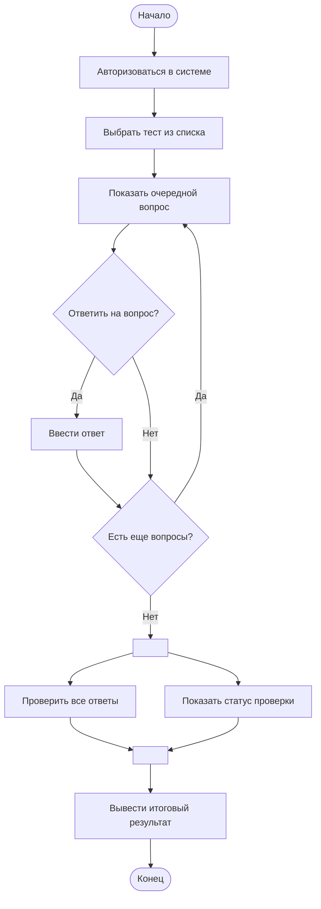

# Диаграмма деятельности: Прохождение теста в системе онлайн-обучения

## Описание процесса
Студент авторизуется в системе, выбирает доступный тест из списка, после чего система последовательно предъявляет вопросы. Студент отвечает на каждый вопрос, имея возможность пропустить его. Процесс повторяется, пока есть неотвеченные вопросы. После ответа на последний вопрос запускается параллельная обработка: система проверяет ответы, а студенту показывается статус завершения. По окончании проверки результат выводится на экран, и процесс завершается.

## Диаграмма

## Пояснения к диаграмме деятельности

### Ключевые шаги

**Авторизация и выбор теста**
:   Процесс начинается с обязательной авторизации пользователя, после чего он выбирает конкретный тест из списка доступных. Без успешной авторизации дальнейшие действия невозможны.

**Цикл вопросов**
:   Блоки `ShowQuestion` (Показать очередной вопрос), `AnswerDecision` (Ответить на вопрос?), `EnterAnswer` (Ввести ответ) и `MoreQuestions` (Есть еще вопросы?) образуют замкнутый цикл. Этот механизм позволяет системе последовательно, один за другим, предъявлять студенту вопросы теста.
    
    - **Ветвление `AnswerDecision`** (узел решения типа «ромб») дает возможность **пропустить** вопрос, не вводя ответ, что не приводит к досрочному завершению всего теста.
    - Условие `MoreQuestions` проверяет, остались ли неотвеченные или пропущенные вопросы. Если такие вопросы есть — студент возвращается к шагу `ShowQuestion`.

**Завершение теста**
:   Как только список неотвеченных вопросов оказывается пуст (условие `MoreQuestions` ложно), управление передается на **узел разделения (`Fork`)**. Это инициирует финальную стадию процесса.

### Параллельные ветви (fork/join)

Для обеспечения корректной и отзывчивой работы системы в финальной части процесса используются два параллельных потока.

**Узел разделения (`Fork`)**
:   После завершения последнего вопроса запускаются одновременно:
    1.  **`CheckAnswers` (Проверить все ответы)** — фоновый, невидимый пользователю процесс, в ходе которого система сверяет ответы студента с правильными вариантами и рассчитывает итоговый балл.
    2.  **`ShowProgress` (Показать статус "Проверка...")** — процесс, отвечающий за пользовательский интерфейс. Он отображает студенту индикатор выполнения проверки (например, спиннер или прогресс-бар), давая понять, что его результаты обрабатываются.

**Узел соединения (`Join`)**
:   Этот узел работает как барьер синхронизации. Поток управления не пойдет дальше, пока **оба** входящих процесса не будут полностью завершены. Только после того, как система закончит проверку ответов (`CheckAnswers`), а интерфейс отобразит статус (`ShowProgress`), произойдет переход к последнему шагу — **`DisplayResult` (Вывести итоговый результат)**.

---

## Контрольные вопросы

**1. Что такое диаграмма деятельности и для чего она используется?**

Диаграмма деятельности — это вид UML, показывающий последовательность действий, ветвления, параллельные потоки и синхронизацию. Используется для моделирования бизнес-процессов, алгоритмов, сценариев использования и рабочих потоков.

---

**2. Чем диаграмма деятельности отличается от блок-схемы?**

Блок-схема обычно показывает алгоритм шаг за шагом без параллелизма. Диаграмма деятельности поддерживает:

    параллельные потоки (fork/join),

    синхронизацию,

    дорожки (swimlanes),

    более богатую семантику для бизнес-процессов.

---

**3. Как обозначается начальный узел в Mermaid?** 

([*]) или текстовый узел ([Начало]). Рекомендуется использовать ([Текст]) для наглядности.

---

**4. Как обозначается узел решения (ветвление)?**

В Mermaid — id{Текст} (ромб). Например: CheckPIN{PIN верен?}.

---

**5. Как в Mermaid реализовать параллельные ветви (fork/join)?**

Прямого символа «жирная черта» нет, но параллелизм моделируется так:

Fork: узел, из которого выходит несколько стрелок (например, Fork --> A и Fork --> B).

Join: узел, в который входит несколько стрелок (например, A --> Join и B --> Join).

---

**6. Зачем нужны узлы слияния (merge) и соединители (join)?**

Merge — собирает альтернативные потоки (после ветвления) в один без ожидания. Несколько входов → один выход.

Join — синхронизирует параллельные потоки: ждёт завершения всех входов, затем передаёт управление дальше.

---

**7. Какие правила именования действий вы знаете?**

Действия должны называться глаголами в начальной форме: «Проверить», «Вычислить», «Загрузить».

    Название должно быть кратким и понятным.

    Избегать пассивного залога.

---

**8. Можно ли на одной диаграмме деятельности иметь несколько конечных узлов?**

Да, это допустимо. Разные сценарии могут приводить к разным завершениям (успех, ошибка, отмена). Каждый конечный узел обозначается кружком с точкой внутри или текстовым узлом ([Конец]).

## Источники

- [Mermaid.js Documentation](https://mermaid.js.org/syntax/flowchart.html) — синтаксис flowchart и моделирование fork/join.
- [OMG UML Specification 2.5.1](https://www.omg.org/spec/UML/2.5.1) — официальное описание activity diagrams.
- Буч Г., Рамбо Д., Якобсон А. — «Язык UML. Руководство пользователя», 2021.
- Mermaid Live Editor: https://mermaid.live
- Материалы практической работы №15 (кафедра программной инженерии, 2026).