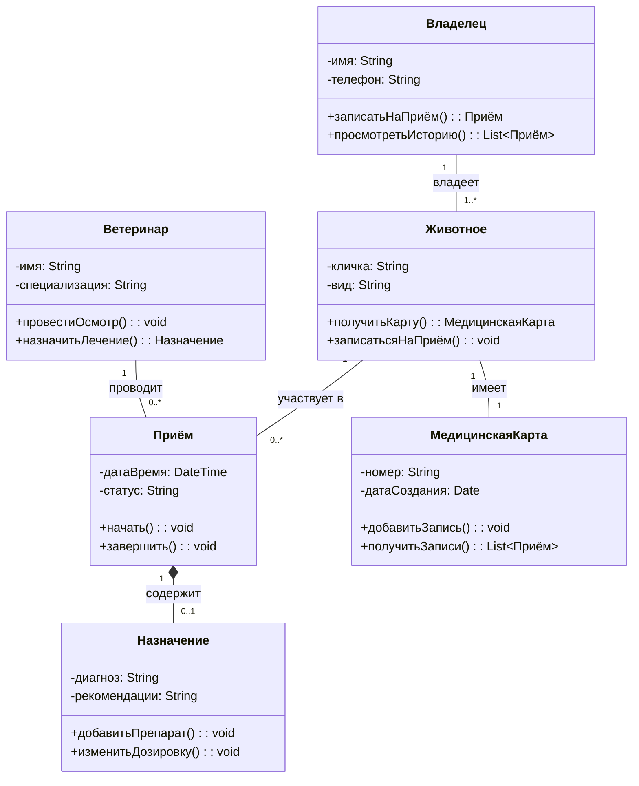

# Диаграмма классов: Система ветеринарной клиники

## Описание предметной области

Система ветеринарной клиники автоматизирует запись на приём, ведение медицинских карт животных, назначение лечения, взаимодействие с лабораторией и проведение оплаты. Владелец записывает питомца на приём к ветеринару. Ветеринар проводит осмотр, назначает лечение и при необходимости оформляет рецепт. Администратор управляет расписанием врачей и формирует отчёты. Лаборатория принимает анализы и возвращает результаты.

Основные классы:

- **Владелец** — клиент клиники, записывает питомцев на приём и просматривает историю визитов.
- **Ветеринар** — врач, проводит осмотр, ставит диагноз и назначает лечение.
- **Животное** — пациент клиники, привязан к владельцу.
- **Приём** — связывает ветеринара, животное и назначение.
- **МедицинскаяКарта** — история болезни одного животного, содержит записи о приёмах.
- **Назначение** — диагноз и рекомендации, выписанные врачом на конкретном приёме.
## Диаграмма


---

## Список классов с пояснением их роли

- **Владелец** — клиент клиники, который приводит питомца на приём. Может записать животное на приём и просмотреть историю его визитов.
- **Ветеринар** — врач, проводящий осмотр животного и назначающий лечение. Имеет специализацию (терапевт, хирург и т.д.).
- **Животное** — пациент ветеринарной клиники. Имеет кличку и вид. Привязано к конкретному владельцу.
- **Приём** — фиксирует факт визита животного к врачу. Содержит дату, время и статус. Связывает ветеринара, животное и назначение.
- **МедицинскаяКарта** — история болезни одного животного. Содержит все записи о приёмах за всю жизнь питомца.
- **Назначение** — диагноз и рекомендации, выписанные врачом на конкретном приёме. Может содержать список препаратов.

---

## Описание ключевых отношений

- **Владелец `1` -- `1..*` Животное : владеет**
  Ассоциация «один ко многим». У одного владельца может быть один или несколько питомцев. Каждое животное привязано ровно к одному владельцу.

- **Ветеринар `1` -- `0..*` Приём : проводит**
  Ассоциация «один ко многим». Один ветеринар может провести много приёмов (или ни одного, если у него нет пациентов). Каждый приём ведёт ровно один ветеринар.

- **Животное `1` -- `0..*` Приём : участвует в**
  Ассоциация «один ко многим». Одно животное может посещать клинику много раз (или ни разу, если его ещё не приводили). Каждый приём относится к одному конкретному животному.

- **Животное `1` -- `1` МедицинскаяКарта : имеет**
  Ассоциация «один к одному». Каждое животное имеет ровно одну медицинскую карту, которая заводится при первом визите. Карта принадлежит ровно одному животному.

- **Приём `1` *-- `0..1` Назначение : содержит**
  Композиция. Назначение создаётся только в рамках приёма и не может существовать отдельно от него. Если приём отменяется, назначение также удаляется. Не каждый приём заканчивается назначением (0..1), например, профилактический осмотр.

---

## Объяснение выбранных типов связей

- **Композиция (`*--`)** — использована для связи Приёма и Назначения, так как назначение жёстко привязано к конкретному приёму. Без приёма назначение не имеет смысла и не может существовать в системе.

- **Ассоциация (`--`)** — использована для всех остальных связей. Владелец и Животное, Ветеринар и Приём, Животное и Приём, Животное и МедицинскаяКарта — это устойчивые, но не жёсткие связи. Объекты могут существовать независимо друг от друга.

- **Наследование** — в данной упрощённой диаграмме не используется, так как классы Владелец и Ветеринар не имеют общих атрибутов и методов, вынесенных в абстрактный класс.

--- 

## Контрольные вопросы
## 1. Что такое диаграмма классов и для чего она используется?

Диаграмма классов — это основной вид диаграмм статической структуры в UML. Она показывает классы системы, их атрибуты, методы и связи между ними. Используется для документирования архитектуры, генерации кода и проектирования баз данных.

---

## 2. Какие три основные секции имеет прямоугольник класса?

    Имя класса (обязательно, жирным шрифтом).

    Атрибуты (свойства класса с указанием видимости и типа).

    Методы (операции с видимостью, параметрами и возвращаемым типом).

---

## 3. Что означают символы ‘+’, ‘-’, ‘#’ перед атрибутами и методами?

    + — public (доступен всем).

    - — private (доступен только внутри класса).

    # — protected (доступен внутри класса и его наследникам).

---

## 4. Как в Mermaid обозначается наследование?

ChildClass --|> ParentClass

---

## 5. В чём разница между агрегацией и композицией?

Агрегация (o--) — часть может существовать независимо от целого (например, игрок может перейти в другую команду).

Композиция (*--) — часть не может существовать без целого (например, комнаты не существуют без дома).

---

## 6. Как указать множественность отношения (например, «один ко многим»)?

В Mermaid множественность указывается в кавычках у концов связи:

```
ParentClass "1" -- "0..*" ChildClass
```

---

## 7. Как изобразить интерфейс в Mermaid?

```
classDiagram
    class НазваниеИнтерфейса {
        <<interface>>
        +метод(): тип
    }
```
---

## 8. Какую информацию можно указать в сигнатуре метода?

    Видимость (+, -, #)

    Имя метода

    Параметры (имя и тип, возможно значение по умолчанию)

    Возвращаемый тип

