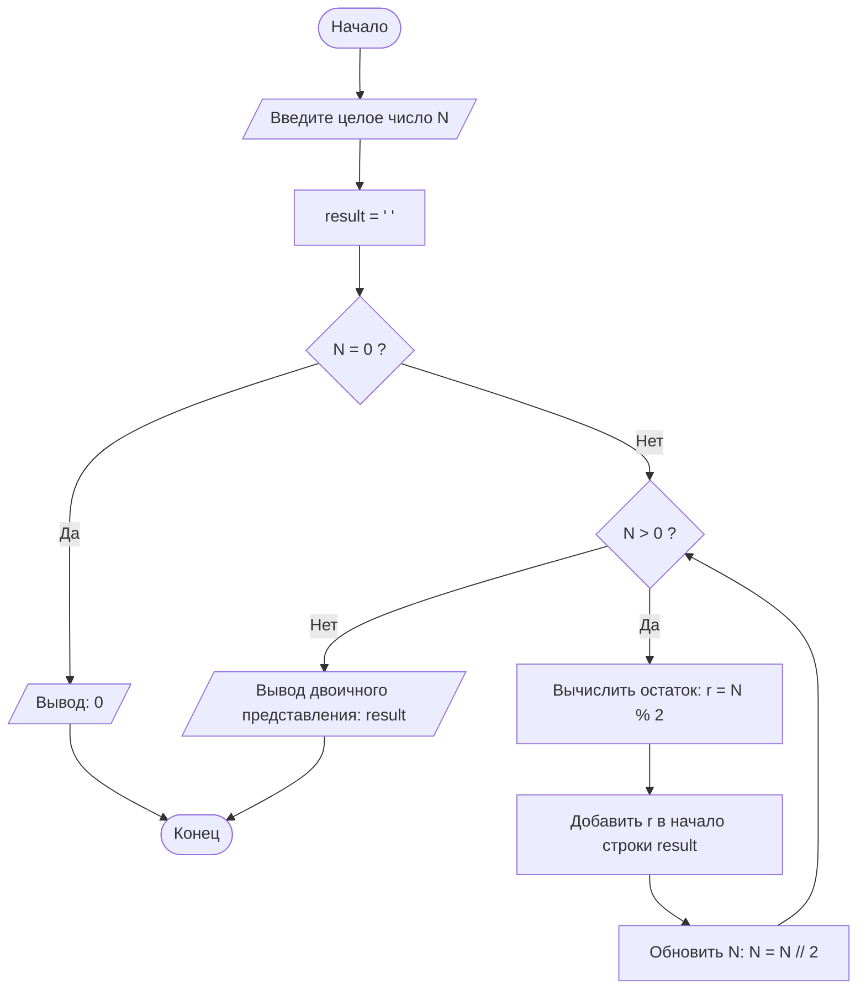

# Блок-схема алгоритма "Перевод числа из десятичной системы в двоичную"

**Описание алгоритма:**

Алгоритм выполняет преобразование целого положительного десятичного числа в его двоичное представление. Основан на последовательном делении исходного числа на 2 с запоминанием остатков. Результат формируется путём чтения остатков в обратном порядке.

**Входные данные:** Целое положительное десятичное число (N).  
**Выходные данные:** Строка, представляющая число в двоичной системе счисления.

---

## Диаграмма



---

## Описание шагов алгоритма

1. **Начало** – запуск программы.
2. **Ввод данных** – пользователь вводит целое десятичное число N.
3. **Инициализация** – создаётся пустая строка `result` для накопления двоичных цифр.
4. **Проверка на ноль** – если N = 0, сразу выводится результат «0».
5. **Цикл деления** – пока N больше нуля:
   - **Остаток от деления** – вычисляется `r = N % 2` (0 или 1).
   - **Добавление в результат** – цифра `r` вставляется в начало строки `result`.
   - **Обновление числа** – N делится нацело на 2 (`N = N // 2`).
6. **Вывод результата** – когда N становится равным 0, накопленная строка `result` содержит искомое двоичное число.
7. **Конец** – завершение алгоритма.

---


## Контрольные вопросы

**1. Что такое Mermaid и для чего он используется?**

Mermaid – это язык разметки для создания диаграмм и схем непосредственно в текстовом виде. Он используется для встраивания диаграмм в Markdown-документы без использования внешних графических редакторов.

**2. Как вставить диаграмму в Markdown-документ?**

Диаграмма вставляется с помощью блока кода с указанием языка `mermaid`:

```markdown
\```mermaid
flowchart TD
    Start --> Stop
\```
```

**3. Какие типы узлов (фигур) доступны в блок-схемах Mermaid?**

| Форма | Синтаксис | Назначение |
|-------|-----------|-------------|
| Прямоугольник | `id[Текст]` | Процесс |
| Скругленный | `id(Текст)` | Процесс |
| Ромб | `id{Текст}` | Условие |
| Овал | `id([Текст])` | Начало/конец |
| Параллелограмм | `id[/Текст/]` | Ввод/вывод |

**4. Чем отличаются стрелки `-->` и `-- текст -->`?**

- `-->` – простая стрелка без подписи
- `-- текст -->` – стрелка с текстовой подписью (используется для обозначения условий "Да"/"Нет")

**5. Как изменить ориентацию диаграммы с вертикальной на горизонтальную?**

Изменить направление графа:
- `TD` (Top-Down) – сверху вниз (вертикальная)
- `LR` (Left-Right) – слева направо (горизонтальная)

**6. Зачем нужны подграфы (subgraph)?**

Подграфы позволяют группировать связанные узлы для логического структурирования сложных диаграмм.

**7. Какие символы нельзя использовать в идентификаторах узлов?**

В идентификаторах узлов нельзя использовать: пробелы, знаки препинания, кавычки, скобки, специальные символы.

**8. Почему важно указывать начальный и конечный узлы?**

Начальный и конечный узлы явно обозначают границы алгоритма, делая блок-схему полной и понятной для чтения.