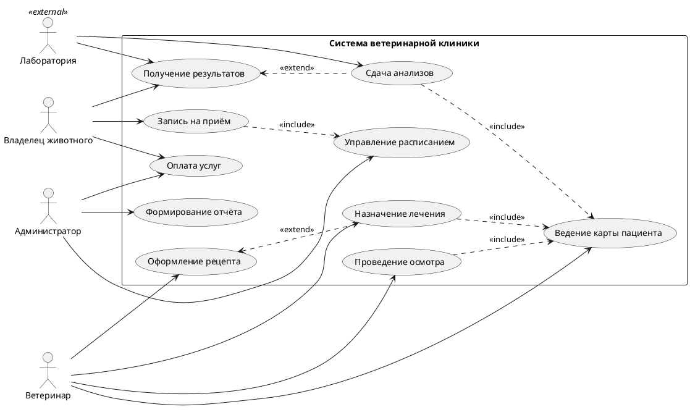

```puml
@startuml
left to right direction
skinparam packageStyle rectangle

actor "Владелец животного" as owner
actor "Ветеринар" as vet
actor "Администратор" as admin
actor "Лаборатория" as lab <<external>>

rectangle "Система ветеринарной клиники" {
    usecase "Запись на приём" as UC1
    usecase "Проведение осмотра" as UC2
    usecase "Назначение лечения" as UC3
    usecase "Оформление рецепта" as UC4
    usecase "Сдача анализов" as UC5
    usecase "Получение результатов" as UC6
    usecase "Управление расписанием" as UC7
    usecase "Ведение карты пациента" as UC8
    usecase "Формирование отчёта" as UC9
    usecase "Оплата услуг" as UC10

    owner --> UC1
    owner --> UC6
    owner --> UC10

    vet --> UC2
    vet --> UC3
    vet --> UC4
    vet --> UC8

    admin --> UC7
    admin --> UC9
    admin --> UC10

    lab --> UC5
    lab --> UC6

    UC2 ..> UC8 : <<include>>
    UC3 ..> UC8 : <<include>>
    UC5 ..> UC8 : <<include>>
    UC1 ..> UC7 : <<include>>

    UC4 <.. UC3 : <<extend>>
    UC6 <.. UC5 : <<extend>>
}
@enduml
```